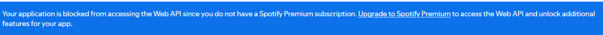
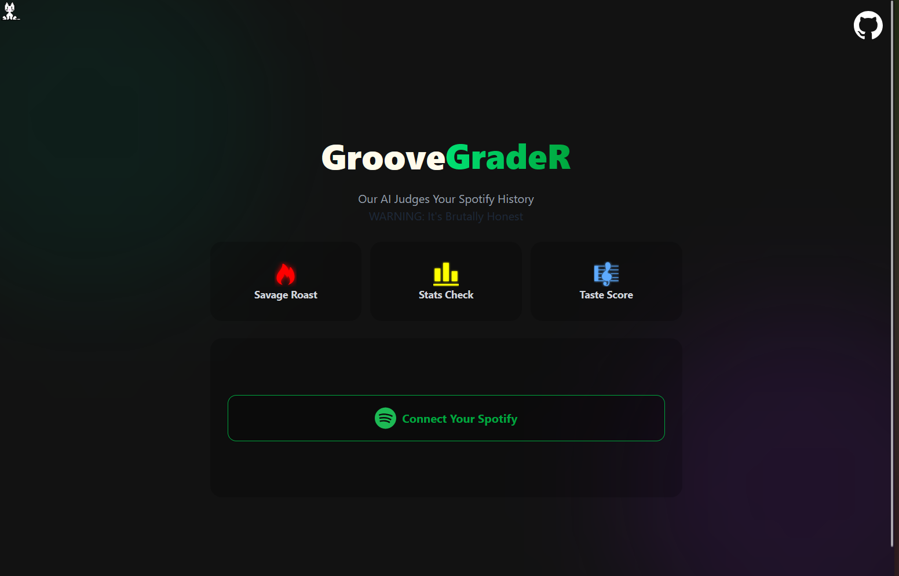

# GrooveGrader

**Note:** Due to Spotify's recent API policy changes, this app no longer works.

> Spotify now requires a **Premium subscription** to access the WEB API.

An AI-powered web app that analyzes your Spotify listening history and roasts your music taste.

## Features

- Gemini AI judges your music taste 
- See your top artists, tracks, and genres
- Get a popularity score based on your listening history

## Tech Stack

**Frontend**

- React + Vite
- Tailwind CSS
- Axios

**Backend**

- Node.js + Express
- Spotify Web API
- Google Gemini AI

## How It Works

1. Connect your Spotify account via OAuth
2. The app fetches your top artists, tracks, and genres
3. Gemini AI generates a personalized roast based on your data
4. View your music stats and share your results
